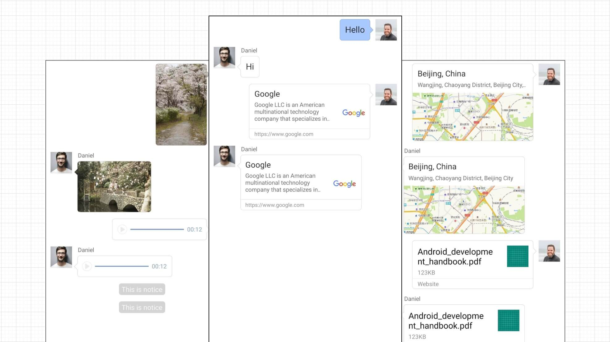
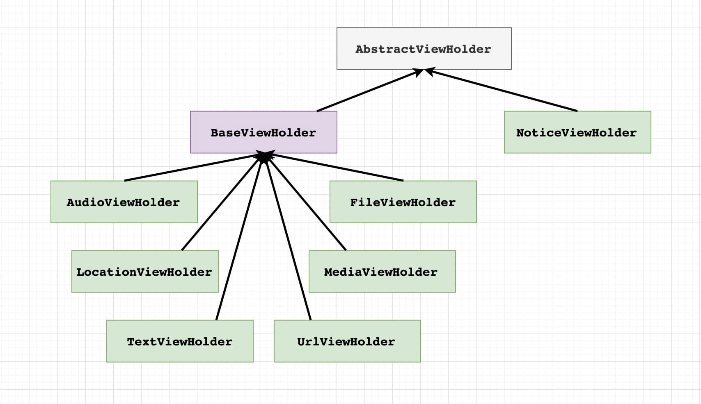

# MessageKit for Android

[中文README](./README_cn.md), [Download APK](https://github.com/phantomVK/MessageKit/releases)

## About

#### Introduction

__MessageKit__ is an open-source repository about chat messages, it shows how to design and develop elegant, useful layouts on displaying messages. 

Pull requests to fix mistakes or improve performance are welcome.



#### feature：

- Repository contains layouts of some staple messages, read the form below for more details.
- Automatically scales the size of thumbnail according to the loading image.
- The style of message draws using paint instead of 9-Patch-PNG to achieve smaller apk size.
- The layout has been abstracted from incoming or outgoing messages.
- Base message model has been abstacted as __IMessage__ to decouple data model from business. 
- The mask of the long pressing is at the foreground of the views instead of background for the best visual effects.
- Loader for loading avatars and images is decoupled, so you can use your favourite framwork.
- Multiple selection of message items is supported, but needs further develpoment.
- Except using LayoutInflator, layouts implemented by Anko(Experimental) are included to avoid blocking the main thread when inflating views with reflection.
- Using design patterns to reduce the complexity maintaining the project.

#### Precautions

- The requirements are variable, this repository does not have the feature of out-of-the-box. The migration of source code to your project is highly recommended. Also, no maven dependency is provided.
- To fix mistakes, please read the update list regularly.
-  Further development to satisfy reqeriments after migrating code may take a long time, think twice before using in business project.
- Please implement features base on the migrated code.

#### Supported types:

__Max Scrap__ on screen resolution: 1920*1080

|   Type   |     Message Name      |     Layout Type     | Max Scrap |
| :------: | :-------------------: | :-----------------: | :-------: |
|   Text   |   MESSAGE_TYPE_TEXT   |   layout_msg_text   |     15    |
|   Url    |   MESSAGE_TYPE_URL    |   layout_msg_url    |     10    |
|  Notice  |  MESSAGE_TYPE_NOTICE  |  layout_msg_notice  |     8     |
| Location | MESSAGE_TYPE_LOCATION | layout_msg_location |     8     |
|  Image   |  MESSAGE_TYPE_IMAGE   |  layout_msg_media   |     8     |
|  Video   |  MESSAGE_TYPE_VIDEO   |  layout_msg_media   |     8     |
|  Audio   |  MESSAGE_TYPE_AUDIO   |   layout_msg_audio  |     14    |
|   File   |   MESSAGE_TYPE_FILE   |   layout_msg_file   |     11    |

## Usage

Migrate the base source code to your project, includes layout resource, string resource, classes and gradle dependencies.

#### model：

This shows how the class implemented __IMessage__ provides data.

```java
public abstract class Message implements IMessage {
    /**
     * Message type, required.
     */
    private String type;

    /**
     * Message id, required.
     */
    private String messageId;

    /**
     * Message body, required.
     */
    private String body;

    /**
     * Message sender, required;
     */
    private String sender;

    /**
     * Message comes from roomId, required.
     */
    private String roomId;

    /**
     * Message timestamp, required.
     */
    private long timestamp;

    public Message(@NonNull String type, @NonNull String body) {
        this.type = type;
        this.body = body;
    }

    public Message(String type, String messageId,
                   String body, String sender,
                   String roomId, long timestamp) {
        this.type = type;
        this.messageId = messageId;
        this.body = body;
        this.sender = sender;
        this.roomId = roomId;
        this.timestamp = timestamp;
    }   
}
```

#### View binding：

Implement your view holder based on __BaseViewHolder__ or __AbstractViewHolder__.



__BaseViewHolder__ extends __AbstractViewHolder__, contains the instance of image loader and etc.

```kotlin
class LocationViewHolder(itemView: View) : BaseViewHolder(itemView) {
    /**
     * The name of the location, required.
     */
    private val mName: TextView = itemView.findViewById(R.id.name)

    /**
     * The address of the location, required.
     */
    private val mAddress: TextView = itemView.findViewById(R.id.address)

    /**
     * The map image of the location, optional.
     */
    private val mImage: ImageView = itemView.findViewById(R.id.image)

    override fun onBind(activity: Activity, message: IMessage) {
        super.onBind(activity, message)
        val msg = message as LocationMessage
        mName.text = msg.name
        mAddress.text = msg.address
        mResLoader.loadImage(activity, message.image ?: "", mImage)
    }
}
```

Use __AbstractViewHolder__ as super class for simpler implements, refer to __NoticeViewHolder__ for more detail.

```kotlin
class NoticeViewHolder(itemView: View) : AbstractViewHolder(itemView) {
    /**
     * Notice text.
     */
    private val mText: TextView = itemView.notice

    /**
     * Override as an empty implementation.
     */
    override fun onHolderCreated() {
    }

    override fun onBind(activity: Activity, message: IMessage) {
        mText.text = message.getBody()
    }
}
```

Register views to HolderRegister.

```kotlin
object HolderRegister {
    private const val HOLDER_TEXT = 2
    private val sViewType = HashMap<String, Int>()
    private val sContentTypes = SparseArray<HolderConfig>()

    init {
        sViewType.put(Message.MESSAGE_TYPE_TEXT, HOLDER_TEXT)
        val textConfig = HolderConfig(R.layout.vkit_layout_msg_text, ::TextViewHolder, 15)
        sContentTypes.put(HOLDER_TEXT, textConfig)
    }
}
```

#### RecyclerView：

RecyclerView from android or the custom class that conflicts fixed are both acceptable.

```xml
<androidx.recyclerview.widget.RecyclerView
    android:id="@+id/messageView"
    android:layout_width="match_parent"
    android:layout_height="match_parent"
    android:background="@android:color/white"
    android:overScrollMode="never"
    android:scrollbars="vertical"
    tools:listitem="@layout/vkit_layout_msg_text"/>
```

#### Adapter

Extends and implements the abstact method of __AbstractMessageAdapter<RecyclerView.ViewHolder>__.

```kotlin
open class MessageAdapter(private val mActivity: Activity,
                          private val mItemListener: IMessageItemListener,
                          resLoader: IMessageResLoader)
    :AbstractMessageAdapter<RecyclerView.ViewHolder>() {
    
    // Some abstract methods must to implement here.
}
```

#### Initialization

Instantiate the class which extends __AbstractMessageAdapter__.

- __MessageItemListener__ processes the action to click and long click.

- __MessageResLoader__ is the subclass of __IMessageResLoader__ to load images.

```kotlin
class MessagesActivity : AppCompatActivity() {
    private lateinit var mAdapter: MessageAdapter

    /**
     * LinearLayoutManager for MessageAdapter.
     */
    private val mLayoutManager = LinearLayoutManager(this, RecyclerView.VERTICAL, false)

    override fun onCreate(savedInstanceState: Bundle?) {
        super.onCreate(savedInstanceState)
        setContentView(R.layout.activity_message)

        // MessageResLoader is a Kotlin singleton.
        mAdapter = MessageAdapter(this, MessageItemListener(), MessageResLoader)
        mAdapter.setHasStableIds(true)

        mLayoutManager.isSmoothScrollbarEnabled = true
        messageView.layoutManager = mLayoutManager
        messageView.adapter = mAdapter
        messageView.setHasFixedSize(true)
        MessageHolders.setMaxScrap(messageView)
    }
}
```

#### Refresh

Refresh UI with __Adapter.notifyItemInserted__.

```kotlin
val msg = TextMessage("Hello")
msg.setSender("Austin")
msg.setTimestamp(1548518400) // millisecond.
mAdapter.add(msg)
mAdapter.notifyDataSetChanged()
```

## License

```
MIT License

Copyright (c) 2019 WenKang Tan

https://github.com/phantomVK/MessageKit/blob/master/LICENSE

Permission is hereby granted, free of charge, to any person obtaining a copy
of this software and associated documentation files (the "Software"), to deal
in the Software without restriction, including without limitation the rights
to use, copy, modify, merge, publish, distribute, sublicense, and/or sell
copies of the Software, and to permit persons to whom the Software is
furnished to do so, subject to the following conditions:

The above copyright notice and this permission notice shall be included in all
copies or substantial portions of the Software.

THE SOFTWARE IS PROVIDED "AS IS", WITHOUT WARRANTY OF ANY KIND, EXPRESS OR
IMPLIED, INCLUDING BUT NOT LIMITED TO THE WARRANTIES OF MERCHANTABILITY,
FITNESS FOR A PARTICULAR PURPOSE AND NONINFRINGEMENT. IN NO EVENT SHALL THE
AUTHORS OR COPYRIGHT HOLDERS BE LIABLE FOR ANY CLAIM, DAMAGES OR OTHER
LIABILITY, WHETHER IN AN ACTION OF CONTRACT, TORT OR OTHERWISE, ARISING FROM,
OUT OF OR IN CONNECTION WITH THE SOFTWARE OR THE USE OR OTHER DEALINGS IN THE
SOFTWARE.
```
